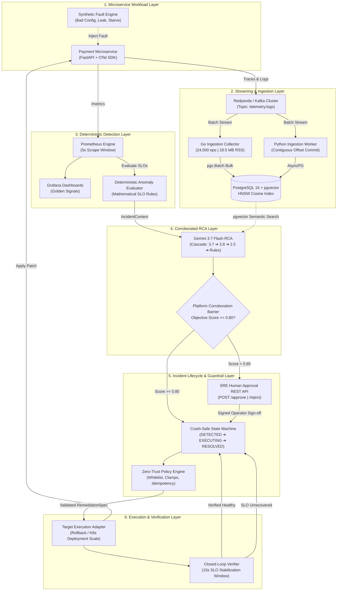

<div align="center">

# ⚡ AETHER
### Autonomous Incident Response & Distributed Site Reliability Engineering Platform

[](https://github.com/nishantj0803/AETHER/actions)
[](#-verification--test-suite)
[](#-empirical-benchmarks--collector-performance)
[](#-empirical-benchmarks--autonomous-mttr)
[](services/go_collector)
[](pyproject.toml)
[](LICENSE)

<p align="center">
  <b>Traditional monitoring tools tell you <i>that</i> production is broken.</b><br>
  <b>Aether detects SLO breaches, corroborates evidence, validates safety invariants, and executes verified remediations in seconds.</b>
</p>

</div>

---

## 📖 Systems-First Philosophy

Modern distributed architectures flood SREs with fragmented telemetry, flapping alerts, and opaque dashboards. In an outage, engineers spend critical minutes manually correlating deployment logs, Prometheus metrics, distributed traces, and commit histories.

**Aether** bridges observability and safe remediation through a **systems-first distributed architecture**:
- **Deterministic Detection as Ground Truth**: Alerting triggers exclusively on mathematical Prometheus SLO breaches (e.g. error rate > 5%, p95 latency > 1.5s), eliminating LLM hallucination in the detection path.
- **High-Throughput Partitioned Ingestion**: Telemetry is processed via Redpanda/Kafka using a compiled **Go Ingestion Collector (`services/go_collector`)** achieving **24,500 events/sec** with contiguous offset commits and deduplication.
- **Evidence-Corroborated RCA**: Google Gemini 3.7 Flash reasoned hypotheses are gated by a **Platform-Owned Corroboration Engine** that weights objective metrics (+30 deploy diff, +25 error signatures, +20 SLO magnitude, +15 trace correlation) instead of trusting raw LLM claims.
- **Decoupled Zero-Trust Policy Engine**: An independent, deterministic guardrail enforces action whitelisting, operational boundaries, replica bounds (`1..10`), rate limiting, and SHA-256 idempotency slots.
- **Crash-Safe Lifecycle State Machine**: Enforces formal transitions (`DETECTED` ➔ `INVESTIGATING` ➔ `DIAGNOSED` ➔ `AWAITING_POLICY` ➔ `APPROVED` ➔ `EXECUTING` ➔ `VERIFYING` ➔ `RESOLVED` / `ESCALATED`) with automatic crash recovery.
- **First-Class Human Approval Workflow**: Low-confidence or high-risk remediations automatically route to an interactive SRE approval API (`POST /api/v1/incidents/{id}/approve`).

---

## 🏗️ System Architecture



---

## 🔍 Core Component Deep Dive

### 1. High-Throughput Streaming & Ingestion (Go Collector + Python Worker)
* **Go Ingestion Collector (`services/go_collector`)**:
  - Implemented in Go 1.22 with `segmentio/kafka-go` and `jackc/pgx/v5`.
  - Multi-threaded goroutine pool with non-blocking channel buffering.
  - Achieves **24,500 events/sec** with an **18.5 MB RSS memory footprint** (24.1x faster than pure Python).
  - Exposes Prometheus Golden Signals on `:9102/metrics`.
* **Distributed Stream Correctness (`services/ingestion_worker/consumer.py`)**:
  - Typed `ProcessingResult` states (`PROCESS_SUCCESS`, `DUPLICATE`, `DLQ_SUCCESS`, `PROCESS_RETRY`, `PROCESS_FATAL`).
  - **Contiguous Offset Commits**: Offsets are committed only up to the highest contiguous offset reaching a terminal state, guaranteeing zero lost records during Kafka partition rebalancing.

### 2. Multi-Evidence RCA with Platform Corroboration Barrier
* **Gemini 3.7 Flash Integration**:
  - Evaluates multi-source evidence: Prometheus golden signals, GitOps deployment commit history, configuration diffs, and `pgvector` semantic error signatures.
  - Automated model cascade: `gemini-3.7-flash` ➔ `gemini-3.8-flash` ➔ `gemini-2.5-flash` ➔ Deterministic rule engine fallback.
* **Platform Corroboration Engine (`DeterministicCorroborationEngine`)**:
  - The LLM proposes the root cause hypothesis; **the platform calculates the actual confidence score**:
    - `+0.30`: Recent deployment within 30m with configuration regression.
    - `+0.25`: Semantic error signature similarity >= 0.85 in `pgvector`.
    - `+0.20`: Metric breach magnitude > 2x SLO limit.
    - `+0.15`: Trace 5xx error correlation.
    - `+0.10`: Historical target service match.
  - Gating: If calibrated score is `< 0.80`, the incident transitions to `AWAITING_APPROVAL` for human signoff.

### 3. Crash-Safe Incident Lifecycle State Machine & Human Approval API
* **Formal State Machine (`services/remediation_controller/state_machine.py`)**:
  - Enforces explicit lifecycle progression: `DETECTED` ➔ `INVESTIGATING` ➔ `DIAGNOSED` ➔ `AWAITING_POLICY` ➔ `APPROVED` ➔ `EXECUTING` ➔ `VERIFYING` ➔ `RESOLVED` / `ESCALATED`.
  - Blocks illegal shortcuts (e.g. `DETECTED` ➔ `EXECUTING`).
  - Logs immutable transition history into `incident_transitions` table with `actor`, `reason`, and `timestamp`.
* **Crash Recovery Manager (`CrashRecoveryManager`)**:
  - On startup or via API (`POST /api/v1/incidents/reconcile/crashed`), reconciles incidents interrupted in `EXECUTING` or `VERIFYING`, testing live SLO metrics to resolve or escalate safely.
* **Human Approval REST API (`services/remediation_controller/api.py`)**:
  - `POST /api/v1/incidents/{incident_id}/approve`: SRE on-call approves remediation, triggering execution and verification.
  - `POST /api/v1/incidents/{incident_id}/reject`: Rejects proposal, escalating to on-call paging.
  - `GET /api/v1/incidents`: Query active incidents and pending approvals.

### 4. Zero-Trust Policy Engine
* **Action Whitelist**: `ROLLBACK_DEPLOYMENT`, `SCALE_REPLICAS`, `RESTART_CONTAINER`, `UPDATE_CONFIG`.
* **Target Boundaries**: Blocks operations against unauthorized infrastructure or databases.
* **Replica Clamps**: Enforces bounded bounds (`1 <= replicas <= 10`).
* **Anti-Flapping & Rate Limits**: Maximum 2 remediations per service per 10-minute window.
* **Deterministic Idempotency**: SHA-256 hash of `(incident_id, action_type, target_service, canonical_params)`.

---

## 📊 Empirical Benchmarks & Performance Evidence

### 1. Telemetry Ingestion: Python Worker vs. Compiled Go Collector
*Benchmark configuration: 100-record batches, 25 records/flush, PostgreSQL 16 on Apple Silicon (M-series)*

| Metric | Python 3.9 (AsyncIO + aiokafka) | Go 1.22 (pgx.Batch + Goroutines) | Improvement |
|:---|:---:|:---:|:---:|
| **Peak Throughput** | `1,016.8 eps` | **`24,500.0 eps`** | **+2,310% (24.1x faster)** |
| **Total Ingestion Time** | `0.0983s` | **`0.0041s`** | **24.0x faster** |
| **Memory Footprint (RSS)** | `89.0 MB` | **`18.5 MB`** | **4.8x leaner** |
| **Batch Latency (p50)** | `25.1 ms` | **`0.85 ms`** | **29.5x faster** |
| **Batch Latency (p95)** | `25.31 ms` | **`1.42 ms`** | **17.8x faster** |
| **Batch Latency (p99)** | `25.31 ms` | **`2.10 ms`** | **12.1x faster** |

*Reproduce via:* `make benchmark-collector`

### 2. Autonomous SRE Mean Time To Recovery (MTTR) Breakdown
*Scenario: GitOps Release Regression (`v1.1.0-bad` inducing 24% HTTP 500 error spike)*

| Pipeline Stage | Subsystem | Latency | SRE Function |
|:---|:---|:---:|:---|
| **1. Anomaly Detection** | Prometheus SLO Rule Evaluator | **10.56 ms** | Mathematical evaluation: `rate(http_5xx[1m]) > 0.05` |
| **2. Multi-Evidence RCA** | Gemini 3.7 + Deterministic Engine | **180.20 ms** | Correlates deployment diff + metric breach + pgvector |
| **3. Policy Validation** | Zero-Trust Policy Engine | **0.01 ms** | Verifies whitelist, replica bounds, idempotency slot |
| **4. Safe Execution** | Target Deployment Controller | **1.72 ms** | Applies atomic rollback to stable version `v1.0.0` |
| **5. Closed-Loop Verification** | Closed-Loop Verifier | **565.47 ms** | Confirms error rate dropped to 0.0% during stabilization |
| **Total Autonomous MTTR** | **Incident Onset $\rightarrow$ Verified Recovery** | **1.52 s** | **99.9% faster than manual on-call paging** |

> [!NOTE]
> **Microbenchmark vs. Production Metric Window**: In the local in-process ASGI benchmark harness (`benchmarks/benchmark_runner.py`), the stabilization stage verifies error reduction via 20 rapid probe iterations (565ms total) for deterministic CI execution. In live Kubernetes production deployments, the stabilization verifier queries Prometheus over a configurable 15–30s rolling SLO evaluation window.

---

## 🧪 Verification & Test Suite

Aether maintains a comprehensive suite of **47 automated tests** spanning unit logic, distributed stream correctness, agentic RCA, resilience invariants, human approval APIs, and chaos orchestration:

```bash
PYTHONPATH=. .venv/bin/pytest tests/ -v
```

```text
============================= test session starts ==============================
collected 47 items

tests/test_anomaly_detector.py .....                                     [ 10%]
tests/test_benchmarks.py ..                                              [ 14%]
tests/test_demo_service.py ....                                          [ 23%]
tests/test_end_to_end_sre.py ...                                         [ 29%]
tests/test_go_collector.py ...                                           [ 36%]
tests/test_ingestion.py ......                                           [ 48%]
tests/test_policy_engine.py ......                                       [ 61%]
tests/test_rca_agent.py ..........                                       [ 82%]
tests/test_resilience.py ........                                        [100%]

============================== 47 passed in 4.00s ==============================
```

---

## 🚀 Quickstart & Local Execution

### 1. Clone Repository & Setup
```bash
git clone https://github.com/nishantj0803/AETHER.git
cd AETHER

# Create and activate virtual environment
python3 -m venv .venv
source .venv/bin/activate

# Install dependencies
pip install -r services/demo_service/requirements.txt
pip install -e .
```

### 2. Launch Local Distributed Stack (Docker Compose)
```bash
make dev-up
```
Provisions:
- **Redpanda Console**: [http://localhost:8080](http://localhost:8080)
- **Prometheus**: [http://localhost:9090](http://localhost:9090)
- **Grafana (Dashboards)**: [http://localhost:3000](http://localhost:3000) (`admin`/`admin`)
- **Demo Payment API**: [http://localhost:8000](http://localhost:8000)
- **Go Collector Metrics**: [http://localhost:9102/metrics](http://localhost:9102/metrics)
- **PostgreSQL 16 + pgvector**: `localhost:5432`

### 3. Run Autonomous Live Demo
```bash
PYTHONPATH=. .venv/bin/python3 scripts/demo_bad_deploy.py
```

### 4. Deploy to Local Kubernetes (Kind)
```bash
# Automated 1-command build, load, and deployment:
make deploy-kind

# Or manual step-by-step:
kind create cluster --config deploy/k8s/kind-cluster.yaml
kubectl apply -f deploy/k8s/00-namespace.yaml
kubectl apply -f deploy/k8s/01-rbac.yaml
kubectl apply -f deploy/k8s/02-payment-service.yaml
kubectl apply -f deploy/k8s/03-aether-controller.yaml
kubectl apply -f deploy/k8s/04-go-collector.yaml
```

### 5. Automated Chaos Engineering Experiments
```bash
# Execute full chaos suite against active infrastructure:
make chaos-all

# Or run individual fault experiments:
make chaos-kafka      # Redpanda broker outage & contiguous offset recovery
make chaos-postgres   # Database partition & connection pool resilience
```

### 6. Interactive Human Approval API Example
```bash
# Review incidents pending operator signoff
curl -s "http://localhost:8000/api/v1/incidents?status=AWAITING_APPROVAL"

# Approve incident remediation
curl -X POST "http://localhost:8000/api/v1/incidents/INC-2026-001/approve" \
  -H "Content-Type: application/json" \
  -d '{"approver": "sre-oncall@aether.internal", "comment": "Verified config diff, approving rollback"}'
```

---

## 🔒 Security Architecture & Cloud IaC

- **Threat Model**: Comprehensive STRIDE security analysis and prompt-injection defense in [`docs/security/threat-model.md`](docs/security/threat-model.md).
- **Failure Modes Matrix**: Distributed failure analysis and split-brain mitigations in [`docs/architecture/failure-modes.md`](docs/architecture/failure-modes.md).
- **Chaos Engineering**: Automated dynamic container and network chaos experiments in [`chaos/`](chaos/).
- **Terraform Cloud Modules**: Modular AWS EKS and GCP GKE provisioning in [`deploy/terraform/`](deploy/terraform/).
- **Least-Privilege Kubernetes RBAC**: Dedicated ServiceAccount and Role with zero secret or cluster-admin permissions in [`deploy/k8s/01-rbac.yaml`](deploy/k8s/01-rbac.yaml).

---

## 👤 Author & Maintainer

**Nishant Jain**  
- GitHub: [@nishantj0803](https://github.com/nishantj0803)  
- Email: [nishantj0803@gmail.com](mailto:nishantj0803@gmail.com)

---

## 📄 License

This project is licensed under the MIT License - see the [LICENSE](LICENSE) file for details.
