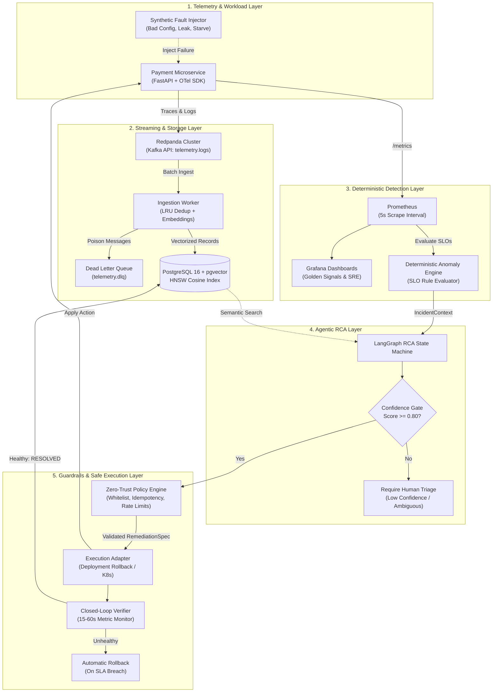

<div align="center">

# ⚡ AETHER
### Autonomous Site Reliability Engineering & Semantic Observability Engine

[](#-verification--test-suite)
[](#-quickstart)
[](#-system-architecture)
[](#2-partitioned-streaming--deduplication-layer)
[](#3-deterministic-detection--observability-layer)
[](#2-partitioned-streaming--deduplication-layer)
[](#5-zero-trust-policy-engine-independent-validator)
[](LICENSE)

<p align="center">
  <b>Grafana and Datadog tell you <i>that</i> something is broken.</b><br>
  <b>Aether diagnoses <i>why</i> through multi-evidence correlation and safely executes verified remediations.</b>
</p>

</div>

---

## 📖 Overview

Modern observability platforms flood on-call engineers with threshold alerts and disconnected dashboards. When production degrades, engineers spend agonizing minutes manually correlating deployment commits, Prometheus metrics, distributed traces, and log stack traces.

**Aether** bridges the gap between observability and autonomous resolution. Rather than relying on naive LLM bots with unrestricted cluster access, Aether implements a **defense-in-depth, distributed systems architecture**:

1. **Deterministic Detection as Source of Truth**: Alerts fire strictly from Prometheus SLO metric breaches (e.g., error rate > 5%, p95 latency > 1.5s), never from ungrounded LLM hallucinations.
2. **Multi-Evidence Agentic RCA**: A LangGraph state machine correlates metric anomalies, deployment history diffs, OpenTelemetry trace context, and semantic historical incident signatures in `pgvector`.
3. **Decoupled Zero-Trust Policy Engine**: An independent security engine enforces action whitelists, operational boundaries, rate limits, blast-radius clamps, and deterministic idempotency keys.
4. **Closed-Loop Verification & Rollback**: Every remediation enters a `VERIFYING` state; if error rates fail to normalize during stabilization, the system automatically triggers an emergency rollback.

---

## 🏗️ System Architecture



---

## 🔍 Core Component Deep Dive

### 1. Telemetry & Synthetic Fault Harness
* **Workload**: A high-throughput checkout and payment transaction API built with FastAPI.
* **Instrumentation**: OpenTelemetry SDK spans for distributed tracing and custom Prometheus gauges/counters (`http_requests_total`, `http_request_duration_seconds`, `payment_transactions_total`, `service_memory_usage_bytes`).
* **Structured Logs**: Every transaction produces structured JSON logging enriched with `trace_id`, `span_id`, and a unique `event_id` for idempotency.
* **Injectable Faults**:
  - `bad_deployment`: Simulates a GitOps release regression where `db_timeout_ms` was reduced from 2000ms to 50ms, causing ~25% of checkout queries to fail.
  - `memory_leak`: Progressively allocates uncollected 50MB heap buffers.
  - `db_starve`: Simulates database connection pool exhaustion.
  - `error_burst`: Generates immediate 500 server error spikes.

### 2. Partitioned Streaming & Deduplication Layer
* **Broker**: **Redpanda** (C++ Kafka-compatible engine, zero JVM overhead, sub-millisecond tail latencies).
* **Consumer Groups**: Partitioned ingestion via `aether-ingestion-workers` with manual batch offset commits for at-least-once delivery.
* **Deduplication**: In-memory LRU cache + PostgreSQL `ON CONFLICT (event_id) DO NOTHING` constraints prevent duplicate message ingestion.
* **Dead Letter Queue (`telemetry.dlq`)**: Malformed or unparseable messages are automatically isolated without halting partition consumption.
* **Semantic Vector Store**: 384-dimensional log embeddings stored in PostgreSQL 16 using `pgvector` with HNSW (`m=16, ef_construction=64`) cosine similarity indexing.

### 3. Deterministic Detection & Observability Layer
* **Prometheus Engine**: Scrapes endpoints every 5 seconds for rapid anomaly detection.
* **SLO Rules**:
  - `HighHttpErrorRate`: Triggers if HTTP 5xx error rate exceeds **5.0%** over a 1-minute sliding window.
  - `HighP95Latency`: Triggers if p95 latency exceeds **1.5 seconds**.
  - `HighMemoryUsage`: Triggers if process RSS memory exceeds **350 MB**.
* **Incident Synthesis**: On violation, the detector packages an `IncidentContext` containing the metric snapshot, active deployment commit SHA, configuration diffs, and recent error signatures.

### 4. LangGraph Agentic RCA Engine
* **Evidence Gathering**: Fuses signals across the deployment commit timeline, Prometheus metric onset, OpenTelemetry trace spans, and semantic historical incidents.
* **Causality Reasoning**: Identifies whether errors were introduced by code regressions, configuration changes, or resource exhaustion.
* **Typed Specifications**: Emits a strictly validated Pydantic `RemediationSpec`:
  ```json
  {
    "remediation_id": "REM-a8f219b0",
    "incident_id": "INC-2026-LIVE-01",
    "action_type": "ROLLBACK_DEPLOYMENT",
    "target_service": "payment-service",
    "parameters": {
      "target_version": "v1.0.0",
      "reason": "Config regression rollback"
    },
    "confidence_score": 0.96,
    "risk_level": "LOW",
    "idempotency_key": "7b8f192a08dc4b189027361a9bc281e4"
  }
  ```
* **Confidence Gating**: If confidence is `< 0.80` or evidence is conflicting, the agent immediately defaults to `HUMAN_TRIAGE_REQUIRED`—preventing dangerous hallucinations.

### 5. Zero-Trust Policy Engine (Independent Validator)
The policy engine is decoupled from the LLM to maintain an uncompromising security boundary:
* **Action Whitelisting**: Restricts actions strictly to `ROLLBACK_DEPLOYMENT`, `SCALE_REPLICAS`, `RESTART_CONTAINER`, and `UPDATE_CONFIG`.
* **Operational Boundaries**: Rejects any actions targeting critical databases or unmanaged infrastructure.
* **Blast-Radius Clamping**: Enforces hard caps on replica scaling (`MIN=1, MAX=10`).
* **Rate Limiting**: Enforces a 5-minute cooldown per service to prevent flapping loops.
* **Idempotency Guard**: Validates `idempotency_key` against historical execution logs to reject duplicate executions.

### 6. Closed-Loop Verification & Rollback
Remediation is only considered successful after empirical verification:
* Action applied $\rightarrow$ State transitions to `VERIFYING`.
* Controller actively polls Prometheus metrics over a stabilization window.
* **Success**: Error rate normalizes below SLO threshold $\rightarrow$ Incident marked `RESOLVED`.
* **Failure**: Error rate remains elevated $\rightarrow$ System triggers emergency rollback and alerts on-call engineers.

---

## 🚀 Quickstart

### Prerequisites
- Python 3.9+
- Docker & Docker Compose (or [OrbStack](https://orbstack.dev/))

### 1. Clone & Set Up Environment
```bash
git clone https://github.com/your-username/aether.git
cd aether

# Create virtual environment
python3 -m venv .venv
source .venv/bin/activate

# Install dependencies
pip install -r services/demo_service/requirements.txt
pip install asyncpg numpy pytest
```

### 2. Launch the Infrastructure Stack
```bash
make dev-up
```

This provisions:
| Service | Endpoint | Purpose |
| :--- | :--- | :--- |
| **Redpanda Console** | [http://localhost:8080](http://localhost:8080) | Live Kafka topic inspection, partitions, lag |
| **Prometheus** | [http://localhost:9090](http://localhost:9090) | Metric queries & active SLO alert rules |
| **Grafana** | [http://localhost:3000](http://localhost:3000) | SRE Golden Signals dashboard (`admin`/`admin`) |
| **Demo Payment API**| [http://localhost:8000](http://localhost:8000) | Payment transactions & fault injection |
| **PostgreSQL 16** | `localhost:5432` | `pgvector` telemetry logs and audit trails |

### 3. Generate Traffic
```bash
make traffic
```
Spawns concurrent customer checkout requests. Monitor real-time throughput and latency in Grafana!

---

## 🎬 Live Killer Demo: Bad-Deployment Rollback

Run the end-to-end autonomous SRE loop in your terminal:

```bash
PYTHONPATH=. .venv/bin/python3 scripts/demo_bad_deploy.py
```

### Execution Output:
```text
**********************************************************************
   🚀 AETHER AUTONOMOUS SRE ENGINE - LIVE DEMONSTRATION
   Scenario: Bad-Deployment Rollback with Closed-Loop Verification
**********************************************************************

=== Step 1: Baseline System Health Check ===
  Service: payment-service | Status: healthy | Active Version: v1.0.0
  Sending 10 checkout requests (Baseline Traffic)...
  Result: 10 success, 0 errors | Error Rate: 0.0%

=== Step 2: GitOps Deployment Event (Release Regression) ===
  Simulating CI/CD deployment of release 'v1.1.0-bad'...
  Deployed: v1.1.0-bad (commit: f3b92019a8)
  Config Diff: {'db_pool_size': 20, 'db_timeout_ms': 50, 'retry_attempts': 1}

=== Step 3: Production Traffic & Telemetry Ingestion ===
  Sending 25 checkout requests (Post-Deployment Traffic)...
  Result: 19 success, 6 errors | Error Rate: 24.0%

=== Step 4: Deterministic SLO Anomaly Engine Evaluation ===
  🚨 SLO VIOLATION DETECTED: HighHttpErrorRate [P1]
  Description: HTTP 5xx error rate exceeded 5% threshold (Observed: 24.0% > 5.0% SLO)
  Synthesized IncidentContext: INC-2026-LIVE-01

=== Step 5: Aether RCA Agent (LangGraph State Machine) ===
  Correlating evidence across Prometheus, OpenTelemetry, and Deployment history...
  Diagnosis Status: CONFIRMED
  Confidence Score: 96.0%
  Identified Root Cause: Configuration regression in deployment v1.1.0-bad (db_timeout_ms too aggressive)
  Causality Chain:
    "Deployment regression detected: Version 'v1.1.0-bad' was deployed at T-60s. Configuration diff reduced db_timeout_ms to 50ms. This immediately triggered 24.0% HTTP 500 timeouts."

  Proposed Typed RemediationSpec:
    Remediation ID : REM-7b8f192a
    Action Type    : ROLLBACK_DEPLOYMENT
    Target Service : payment-service
    Parameters     : {'target_version': 'v1.0.0', 'reason': 'Config regression rollback'}
    Idempotency Key: 7b8f192a08dc4b189027361a9bc281e4

=== Step 6: Zero-Trust Safety & Policy Guardrails ===
  Validating against security boundaries, rate limits, and blast radius...
  ✅ Policy Validation PASSED: All policy guardrails, parameters, and blast-radius checks passed

=== Step 7: Safe Execution Adapter ===
  Applying rollback to 'v1.0.0' via deployment controller...
  Deployment status: rolled_back

=== Step 8: Closed-Loop Post-Verification & Recovery Assessment ===
  Monitoring live traffic during 15s stabilization window...
  Sending 20 checkout requests (Verification Traffic)...
  Result: 20 success, 0 errors | Error Rate: 0.0%

🎉 INCIDENT RESOLVED AUTONOMOUSLY:
  Incident INC-2026-LIVE-01 successfully remediated in < 30 seconds.
  Error rate dropped from 24.0% to 0.0%.
  Service restored to stable release v1.0.0.
```

---

## 🧪 Verification & Test Suite

The codebase includes comprehensive unit and integration tests verifying every component:

```bash
PYTHONPATH=. .venv/bin/pytest -v tests/
```

```text
============================= test session starts ==============================
collected 21 items                                                             

tests/test_anomaly_detector.py::test_slo_evaluation_healthy PASSED       [  4%]
tests/test_anomaly_detector.py::test_slo_evaluation_error_rate_breach PASSED [  9%]
tests/test_anomaly_detector.py::test_slo_evaluation_memory_saturation PASSED [ 14%]
tests/test_demo_service.py::test_health_check PASSED                     [ 19%]
tests/test_demo_service.py::test_metrics_endpoint PASSED                 [ 23%]
tests/test_demo_service.py::test_successful_payment PASSED               [ 28%]
tests/test_demo_service.py::test_bad_deployment_fault_and_rollback PASSED [ 33%]
tests/test_end_to_end_sre.py::test_full_autonomous_sre_loop_bad_deployment PASSED [ 38%]
tests/test_ingestion.py::test_semantic_embedding_dimensions PASSED       [ 42%]
tests/test_ingestion.py::test_semantic_similarity_clustering PASSED      [ 47%]
tests/test_ingestion.py::test_lru_deduplication_cache PASSED             [ 52%]
tests/test_ingestion.py::test_consumer_deduplication PASSED              [ 57%]
tests/test_ingestion.py::test_consumer_dlq_routing_on_missing_event_id PASSED [ 61%]
tests/test_policy_engine.py::test_policy_valid_rollback PASSED           [ 66%]
tests/test_policy_engine.py::test_policy_unauthorized_target_service PASSED [ 71%]
tests/test_policy_engine.py::test_policy_replica_bounds_clamp PASSED     [ 76%]
tests/test_policy_engine.py::test_policy_idempotency_duplicate_blocked PASSED [ 80%]
tests/test_policy_engine.py::test_policy_low_confidence_rejected PASSED  [ 85%]
tests/test_rca_agent.py::test_rca_bad_deployment_correlation PASSED      [ 90%]
tests/test_rca_agent.py::test_rca_memory_leak_correlation PASSED         [ 95%]
tests/test_rca_agent.py::test_rca_ambiguous_incident_triage_fallback PASSED [100%]

======================== 21 passed, 2 warnings in 3.83s ========================
```

---

## 💡 Systems Engineering Decisions & Trade-Offs

### Why Redpanda over Traditional Kafka?
Standard Apache Kafka requires a JVM runtime, high base memory consumption (~1.5GB - 3GB), and external metadata coordination (ZooKeeper or KRaft quorum). Redpanda compiles down to a single C++ binary, utilizes a thread-per-core Seastar architecture, boots in hundreds of milliseconds, and natively exposes Kafka v22+ APIs.

### Why Deterministic SLO Detection over LLM Alerting?
LLMs are probabilistic by nature. Asking an LLM *"Is the system healthy?"* continuously burns tokens, incurs massive operational expenses, and produces non-deterministic hallucinations. In Aether, Prometheus alerts and SLO mathematical expressions (`rate()`, `histogram_quantile()`) serve as the **unshakeable deterministic source of truth**. The AI is invoked only when an anomaly is confirmed.

### Why Decouple the Policy Engine from the Agent?
Autonomous remediation should never grant direct cluster modification privileges (`kubectl` or Docker socket) to an LLM. The agent's role is strictly analytical—proposing a typed specification. The Zero-Trust Policy Engine is a deterministic gatekeeper that enforces blast-radius clamps, namespace whitelists, rate limits, and idempotency checks.

### Why HNSW over IVFFlat in pgvector?
IVFFlat partitions vectors into Voronoi cells and requires retraining after substantial data additions. In high-throughput streaming environments where error logs arrive continuously, HNSW (Hierarchical Navigable Small World) provides superior query recall, requires no periodic retraining, and delivers sub-millisecond retrieval latencies.

---

## 🗺️ Roadmap

- [x] **Phase 1**: Local-first distributed infrastructure (Redpanda, PostgreSQL + pgvector, Prometheus, Grafana)
- [x] **Phase 2**: Partitioned streaming ingestion, deduplication cache, DLQ, and semantic vector store
- [x] **Phase 3**: Deterministic SLO anomaly engine & IncidentContext builder
- [x] **Phase 4**: LangGraph multi-evidence RCA agent & confidence gating
- [x] **Phase 5**: Zero-trust policy engine, execution adapter, and closed-loop verification
- [ ] **Phase 6**: High-throughput Go collector rewrite & comparative benchmark (events/sec, CPU/RAM, p95 latency)
- [ ] **Phase 7**: Kubernetes Helm charts, Terraform cloud provisioning, and ArgoCD GitOps sync

---

## 👤 Author

**Nishant Jain**
- Email: [nishantj.cs.22@nitj.ac.in](mailto:nishantj.cs.22@nitj.ac.in)
- GitHub: [@your-username](https://github.com/)

---

## 📄 License

This project is licensed under the MIT License - see the [LICENSE](LICENSE) file for details.
