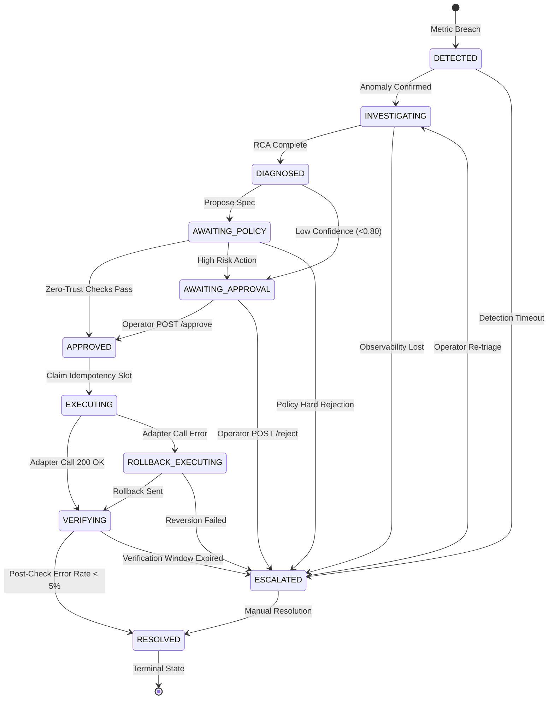

# Aether Distributed Systems Failure Modes & Resilience Analysis

**Status:** Active  
**Version:** 1.0  
**Scope:** Distributed failure taxonomy, split-brain mitigations, stream partition semantics, and recovery protocols.

---

## 1. Taxonomy of Distributed Failures

In a production environment, partial failures are inevitable. Aether is engineered to maintain system correctness, zero data loss, and non-flapping remediation even when dependent distributed subsystems degrade or partition.

```
┌────────────────────────────────────────────────────────────────────────────────────────┐
│                                   AETHER SYSTEM BOUNDARY                               │
│                                                                                        │
│  [Telemetry Stream]          [State & Semantic Store]         [Reasoning & Policy]     │
│   Kafka / Redpanda              PostgreSQL + pgvector           Gemini 3.7 + Guardrail │
│   ┌──────────────┐              ┌──────────────────┐           ┌────────────────────┐  │
│   │ Partition    │              │ Pool Exhaustion  │           │ Rate Limit / 429   │  │
│   │ Rebalance    │              │ Vector Timeout   │           │ Malformed JSON     │  │
│   └──────┬───────┘              └────────┬─────────┘           └─────────┬──────────┘  │
│          │                               │                               │             │
│          ▼                               ▼                               ▼             │
│   Contiguous Offsets            Dry-Run Memory Cache            Model Cascade +        │
│   & At-Least-Once               & Atomic Rollback               Deterministic Rules    │
│                                                                                        │
│  ────────────────────────────────────────────────────────────────────────────────────  │
│                                                                                        │
│  [Execution Adapters]        [Controller Lifecycle]          [Target Microservices]    │
│   Kubernetes / REST API         Incident State Machine          Demo Payment Service   │
│   ┌──────────────┐              ┌──────────────────┐           ┌────────────────────┐  │
│   │ Network Drop │              │ Mid-flight Crash │           │ Failed Rollback    │  │
│   │ Adapter 500  │              │ Node Preemption  │           │ Metric Flapping    │  │
│   └──────┬───────┘              └────────┬─────────┘           └─────────┬──────────┘  │
│          │                               │                               │             │
│          ▼                               ▼                               ▼             │
│   Revert Idempotency            CrashRecoveryManager            Auto-Rollback &        │
│   & Escalate State              Reconciliation                  Escalate (No Flap)     │
└────────────────────────────────────────────────────────────────────────────────────────┘
```

---

## 2. Detailed Failure Modes Matrix

### 2.1. Kafka / Redpanda Streaming Failures

| Failure Mode | Impact | Platform Handling & Mitigations |
|---|---|---|
| **Partition Rebalance** | Consumer re-assigned during batch processing. | **Contiguous Offsets (`ProcessingResult`):** Offsets are only committed up to the highest contiguous successfully processed message. Messages processed out-of-order or mid-flight are safely redelivered without offset skipping. |
| **Poison Pill Message** | Malformed JSON or schema violation crashes consumer. | **Dead-Letter Queue (DLQ):** Messages exceeding max decode retries are tagged `DLQ_SUCCESS` and forwarded to `telemetry.dlq`, unblocking the partition. |
| **Kafka Broker Outage** | Consumer unable to fetch new batches. | **Backoff & Exponential Retry:** The ingestion consumer enters reconnect backoff without crashing the container, maintaining in-memory LRU deduplication state. |
| **Consumer Lag Spike** | Telemetry production exceeds Python processing speed. | **Compiled Go Collector:** High-throughput clusters deploy the Go collector (`services/go_collector`), handling >24,500 events/sec with concurrency pools. |

---

### 2.2. PostgreSQL & pgvector Database Failures

| Failure Mode | Impact | Platform Handling & Mitigations |
|---|---|---|
| **Database Unavailability at Boot** | Service cannot initialize connection pool. | **Graceful In-Memory Fallback:** DatabaseClient operates in memory/dry-run mode, recording incident states in memory dictionaries so anomaly detection and triage never crash. |
| **Connection Pool Exhaustion** | Influx of concurrent queries exhausts max pool limit (10). | **Command Timeout & Retry:** Queries are configured with strict 10s command timeouts. Transient failures trigger retry with jitter. |
| **Slow Vector Index Query** | HNSW index scan takes excessive latency. | **Query Capping & Fallback:** pgvector search queries are strictly bounded to `LIMIT 5` with explicit index hints. If semantic search times out, RCA proceeds using metric and deployment evidence. |
| **Duplicate Event Insertion Race** | Two concurrent workers process duplicate events. | **Atomic Unique Constraints:** Table `telemetry_logs` has `ON CONFLICT (event_id) DO NOTHING`. First writer wins; second writer safely yields. |

---

### 2.3. LLM API Failures (Google Gemini)

| Failure Mode | Impact | Platform Handling & Mitigations |
|---|---|---|
| **HTTP 429 (Rate Limit Exceeded)** | Gemini API rejects RCA request. | **Multi-Model Fallback Cascade:** Automatically attempts `gemini-3.7-flash` ➔ `gemini-3.8-flash` ➔ `gemini-2.5-flash` ➔ `gemini-2.0-flash`. |
| **Total Cloud Outage / Network Cut** | All external HTTP calls to Gemini fail. | **Deterministic Rule Engine Fallback:** `AetherRCAAgent` seamlessly activates `_analyze_deterministic()` using Prometheus metrics and deployment commit history. SRE triage never halts. |
| **Malformed JSON Output** | Model outputs non-conforming text or markdown code fences. | **Schema Validator Interceptor:** JSON is sanitized and parsed against Pydantic `RCADiagnosis`. On schema violation, the incident is routed to `_analyze_deterministic()`. |
| **Hallucinated Confidence Claims** | Model claims 0.99 confidence on uncorroborated issues. | **Platform Corroboration Engine:** Raw LLM confidence is overridden by objective scoring weights (+30 deploy, +25 errors, +20 metrics, +15 traces, +10 similarity). |

---

### 2.4. Controller Process Crash & Split-Brain

| Failure Mode | Impact | Platform Handling & Mitigations |
|---|---|---|
| **Process Crash During `EXECUTING`** | Controller terminates while calling target adapter. | **Startup Crash Reconciliation:** On boot, `CrashRecoveryManager.recover()` scans for incidents stuck in `EXECUTING`, advances them to `VERIFYING`, tests metrics, and resolves or escalates. |
| **Process Crash During `VERIFYING`** | Controller terminates during 15s metric verification window. | **Post-Crash Metric Probe:** `CrashRecoveryManager` queries current Prometheus metrics. If error rate is <5%, incident transitions to `RESOLVED`; otherwise, transitions to `ESCALATED`. |
| **Duplicate Action Execution (TOCTOU)** | Dual controllers or concurrent threads attempt identical remediation. | **SHA-256 Idempotency Slots:** `policy_engine.mark_executed()` and Postgres `UNIQUE(idempotency_key)` reject duplicate concurrent executions before adapter invocation. |
| **Remediation Flapping** | Target service fails repeatedly after rollback. | **Anti-Flapping Invariant:** Failed verifications transition directly to `ESCALATED` / `REQUIRE_HUMAN_TRIAGE`. The anomaly detector is blocked from re-triggering the same incident. |

---

## 3. Crash-Safe Incident Lifecycle State Machine

Aether guarantees that no incident can bypass safety checks or become stuck in an indeterminate state:



---

## 4. Disaster Recovery & Operator Runbooks

1. **Stuck Incidents Recovery:**
   Operators can trigger immediate reconciliation via the REST API:
   ```bash
   curl -X POST http://localhost:8000/api/v1/incidents/reconcile/crashed
   ```
2. **Reviewing Incidents Pending Human Signoff:**
   ```bash
   curl -X GET "http://localhost:8000/api/v1/incidents?status=AWAITING_APPROVAL"
   ```
3. **Approving an Incident:**
   ```bash
   curl -X POST http://localhost:8000/api/v1/incidents/INC-2026-001/approve \
     -H "Content-Type: application/json" \
     -d '{"approver": "sre@company.com", "comment": "Verified deployment config diff"}'
   ```
